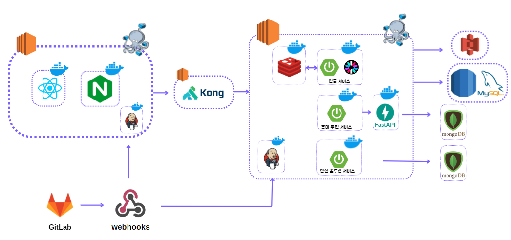
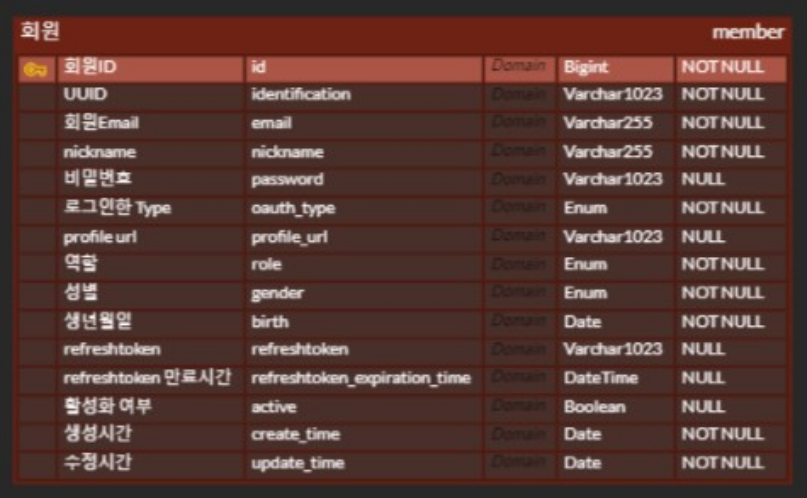
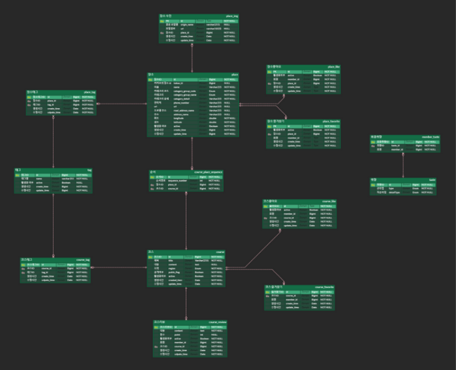
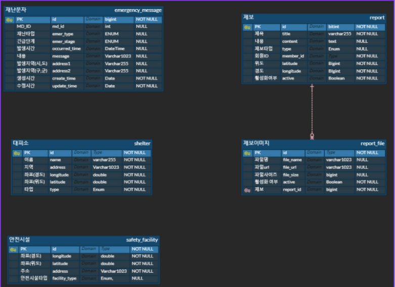

---

## ✈ 배포 주소

 개발 버전 : Version 1.0.0    
 프론트 서버: https://j9d205.p.ssafy.io/    
 백엔드 서버:    
- kong-server : http://ec2-43-201-30-17.ap-northeast-2.compute.amazonaws.com:8000  
- Authentication-service : http://ec2-13-124-94-38.ap-northeast-2.compute.amazonaws.com:8080/swagger-ui/index.html   
- enjoy-service : http://ec2-13-124-94-38.ap-northeast-2.compute.amazonaws.com:8081/swagger-ui/index.html   
- safe-service : http://ec2-13-124-94-38.ap-northeast-2.compute.amazonaws.com:8082/swagger-ui/index.html  
- recommandation-service : http://ec2-13-124-94-38.ap-northeast-2.compute.amazonaws.com:8003/docs

 개발 기간 : 2023.08.21 ~ 2023.10.06 (기능 구현 완료)   
 리팩토링 : 2023.10.10 ~ 진행 중
 개발 인원 : 6명

## ✌️버전

| Version   | Description | Date |
| :------: | ----------------------- |  :--------:|
| 0.1.0 | · 인증 서버 구축   · enjoy 서버 구축   · safe 서버 구축| 2023.09.24 |
| 1.0.0 | · FrontEnd 서버 구축 | 2023.09.27 |

 

## 🧑‍💻 팀원 소개

| 이름 | 김민규 | 김윤욱 | 이서현 | 조영재 |
| :------------: | :------------: | :-----------: |  :------------: | :-----------: |  
|  |  |  |   | |
| 깃허브 | [@kim-min-gyu-ss](https://github.com/kim-min-gyu-ss) | [@RRCoding96](https://github.com/RRCoding96) |[@kathyleesh](https://github.com/kathyleesh)|[@jyj1143](https://github.com/jyj1143)|
| 역할 | BACK-END | BACK-END | BACK-END | BACK-END | 

| 이름 | 윤태웅 | 진재환 | 
| :------------: | :------------: | :-----------: | 
|  |  |  | 
| 깃허브 | [@twoong01](https://github.com/twoong01) | [@Jinga02](https://github.com/Jinga02) | 
| 역할 | FRONT-END | FRONT-END | 

## 📌 프로젝트 소개

### 프로젝트 기획 배경
오송지하차도 침수 사고, 늘어나는 칼부림 등 자연재해나 인재와같은 재난 상황이 발생 하더라도 실시간 현황과 대처 방법을 알지 못해 피해가 발생합니다.  
이러한 피해를 줄이고자 재난 발생 현황과 발생 시 대처할 수 있는 솔루션을 제공하고자 '맞춤형 안전 지도 공유 서비스' 프로젝트를 기획하게 되었습니다.

## 🔎주요 기능 설명
- 취향을 바탕으로 맞춤형 코스 추천
- 코스 커스텀 및 공유
- 재난상활 별 재난 솔루션
- 위험구역 제보 및 안전한 길 추천

 

## 🛠기술 스택

<table>
<tr>
 <td align="center">언어</td>
 <td>
  
  
  
	
	
 </td>
</tr>
<tr>
 <td align="center">프레임워크</td>
 <td>
  
	  
</tr>
<tr>
 <td align="center">라이브러리</td>
 <td>
  

  
  

</tr>
<tr>
 <td align="center">패키지 매니저</td>
 <td>
    
    

  </td>
</tr>
<tr>
 <td align="center">인프라</td>
 <td>
  
  
  
  
  
  
  
  
</tr>
<tr>
 <td align="center">포맷팅</td>
 <td>
   
   
   
  </td>
</tr>

<tr>
 <td align="center">협업툴</td>
 <td>
    
     
     
     
    
 </td>
</tr>
<tr>
 <td align="center">기타</td>
 <td>
    
     
    
 </td>
</tr>
</table>

## 🗂주요기능 
|||
|---|---|
|자체 로그인 기능|소셜 로그인 기능|
|||
|취향 설정 기능|코스 조회 기능|
|||
|코스 만들기 기능|대피소 제보 기능|
|||
|길찾기 기능|
||

## 🧱아키텍처

## 🗂ERD
- MEMBER ERD

- ENJOY ERD

- SAFE ERD

