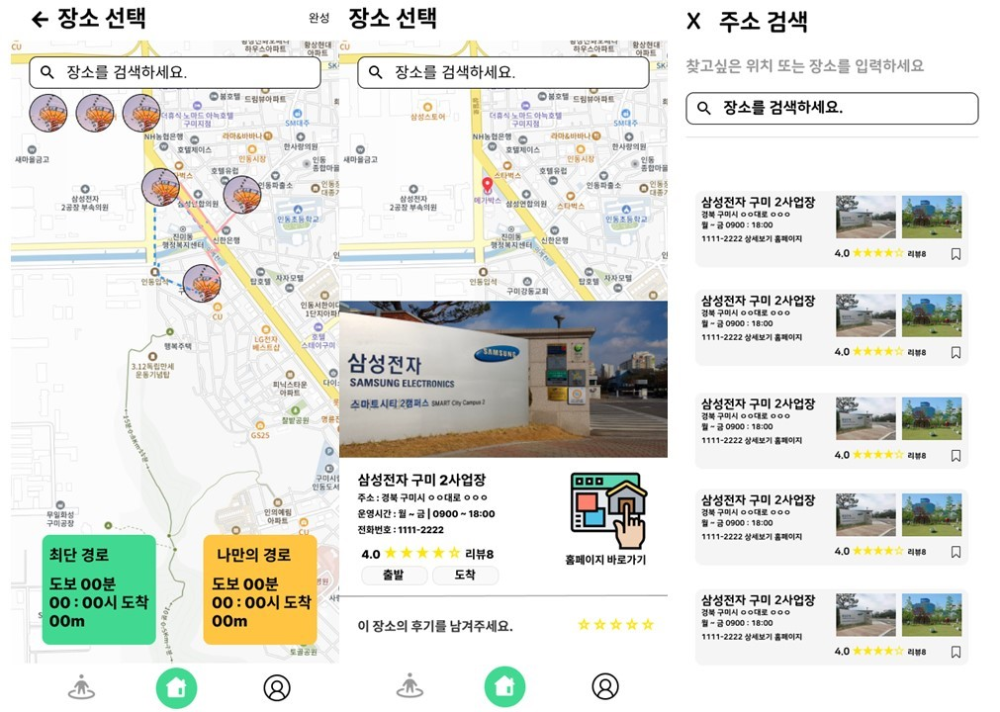

# NUBIO

## ✈ 배포 주소

#### 개발 버전 : Version 0.1.0    
#### 프론트 서버: https://nubi0.com (미배포)    
#### 백엔드 서버:    
- kong-server : http://ec2-43-201-30-17.ap-northeast-2.compute.amazonaws.com:8000  
- Authentication-service : http://ec2-13-209-41-128.ap-northeast-2.compute.amazonaws.com:8080/swagger-ui/index.html   
- enjoy-service : http://ec2-13-209-41-128.ap-northeast-2.compute.amazonaws.com:8081/swagger-ui/index.html (미배포)   
- safe-service : http://ec2-13-209-41-128.ap-northeast-2.compute.amazonaws.com:8082/swagger-ui/index.html (미배포)  

#### 개발 기간 : 2023.08.21 ~    
#### 개발 인원 : 6명

## 📑 목차

1. [프로젝트 기획 배경](#프로젝트-기획-배경)
2. [주요 기능 설명](#주요-기능-설명)
3. [기술 스택](#기술-스택)
4. [프로토타입](#프로토타입)
5. [아키텍처](#아키텍처)
6. [ERD](#erd)
7. [기능 엿보기](#기능-엿보기)
8. [팀원 소개 및 역할](#팀원-소개-및-역할)

## 📌프로젝트 기획 배경

맞춤형 안전 지도 공유 서비스

## 🔎주요 기능 설명
- 취향을 바탕으로 맞춤형 코스 추천  
- 코스 커스텀 및 공유
- 위치기반 재난 솔루션
- 위험구역 제보 및 안전한 길 추천

## 🛠기술 스택

<table>
<tr>
 <td align="center">언어</td>
 <td>
  
  
	
	
 </td>
</tr>
<tr>
 <td align="center">프레임워크</td>
 <td>
  
	  
</tr>
<tr>
 <td align="center">라이브러리</td>
 <td>
  

  
  
  
  

</tr>
<tr>
 <td align="center">패키지 매니저</td>
 <td>
    
    

  </td>
</tr>
<tr>
 <td align="center">인프라</td>
 <td>
  
  
  
  
  
  
  
  
</tr>
<tr>
 <td align="center">포맷팅</td>
 <td>
   
   
   
  </td>
</tr>

<tr>
 <td align="center">협업툴</td>
 <td>
    
     
     
     
    
 </td>
</tr>
<tr>
 <td align="center">기타</td>
 <td>
    
     
    
 </td>
</tr>
</table>

## 🗂 프로토타입
{: width="10" height="10"}

## 🧱아키텍처

## 🗂ERD

## 🧚‍♀️팀원 소개 및 역할

| 이름   | 기능 및 역할                                                                                                                                                                              |
| ------ | ----------------------------------------------------------------------------------------------------------------------------------------------------------------------------------------- |
| 이서현 | 팀장 |
| 김민규 | 팀원                                        |
| 김윤욱 |  팀원                                                                                                                                                                                    |
| 윤태웅 |팀원                                                                                                                                                                                 |
| 조영재 | 팀원                                                                                                                                                                                |
| 진재환 |      팀원                                                                                                                                                                            |
